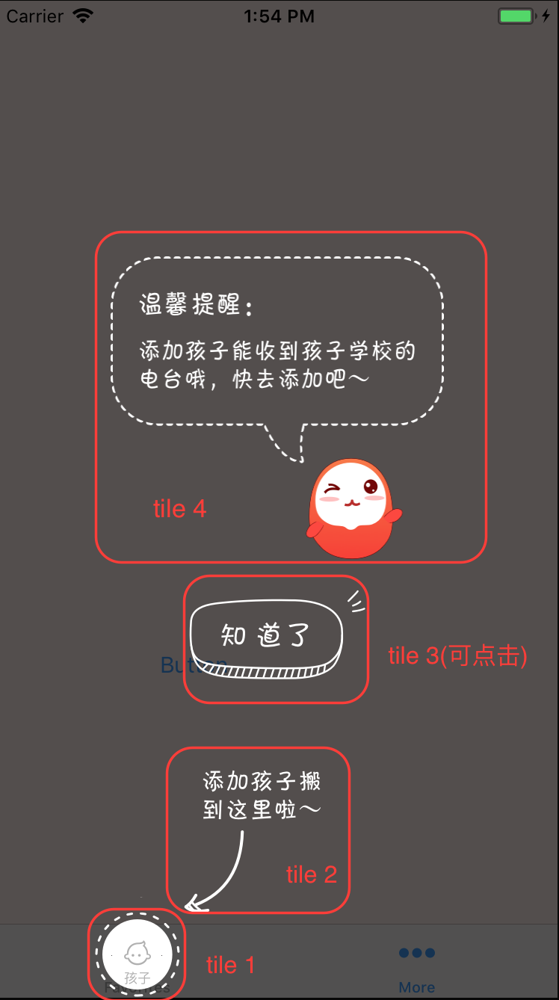

# 一个自定义引导页控件

可用于在 ViewController 上添加一个蒙版层，引导用户行为，当用户点击蒙版层，引导页消失。

## 特性

可在上面添加任意多的 Tile（即小图片），Tile 的位置大小（即 frame）可由你指定，任意 Tile 都可响应点击事件（相当于一个按钮）。如下图所示，从下到上依次添加了 4 个 Tile。



## 用法

将 IntroductionView.h/.m 添加到你的工程。

1. 在 ViewController 中，导入头文件 IntroductionView.h。
2. 让 ViewController 声明实现 IntroductionViewDataSource 协议。
3. 初始化一个 IntroductionView 并设置其 dataSource:

	```swift
	_introView = [[IntroductionView alloc]initWithFrame:self.view.bounds];
	_introView.dataSource = self;
   ```
   
4. 实现 IntroductionViewDataSource 协议的两个方法：

	* -(NSArray<Tile*>*)tilesForIntroductionView:(IntroductionView *)introView
	
		在这个方法中指定要添加到蒙版层上的 Tile 数组。每个 Title 指定图片的文件名和 frame。
	* -(void)introductionView:(IntroductionView *)introView clickAtIndex:(int)index
	
		在这个方法中处理 Tile 点击事件。通过 index 参数（即 Tile 在数组中的索引）判断是哪个 Tile 被点击。不需要响应的 Tile 就不用处理。
		
5. IntroductionView 有两个方法。removeWithCompletion 用于移除引导页。reload 方法在数据源发生改变后刷新 UI。

## Demo

用 Xcode 打开 IntroductionView.xcodeproj。